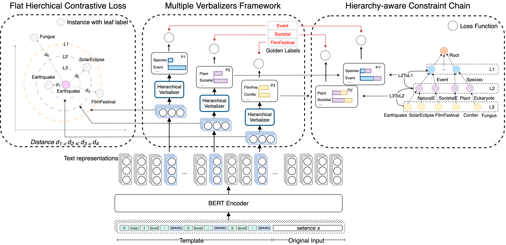

# Hierarchical Verbalizer for Few-Shot Hierarchical Text Classification

This is the official repository for the ACL 2023 paper
[Hierarchical Verbalizer for Few-Shot Hierarchical Text Classification](https://arxiv.org/)

## Requirements

* Python >= 3.6
* torch == 1.10.1
* openprompt == 0.1.2
* transformers == 4.18.0
* datasets == 2.4.0

## Train

```
usage: train.py [-h] [--lr LR] [--dataset DATA] [--batch BATCH] [--device DEVICE] --name NAME [--shot SHOT]
                [--seed SEED]....

optional arguments:
  --lr                      LR, learning rate for BERT.                   
  --lr2                     learning rate for verbalizer.
  --dataset                 {wos,dbp,rcv1} Dataset.
  --batch BATCH             Batch size
  --shot SHOT               fewshot seeting
  --device DEVICE           cuda or cpu. Default: cuda
  --seed SEED               Random seed.
  --constraint_loss         Hierarchy-aware constraint chain
  --contrastive_loss        flat Hierarchical contrastive loss
  --contrastive_level       \alpha
  --constraint_alpha        \lambda_1 the weight of HCC(default -1)
  --contrastive_alpha       \lambda_2 the weight of FHC
```

- Results are in `./result/few_shot_train.txt`.
- Checkpoints are in `./ckpts/`. Two checkpoints are kept based on macro-F1 and micro-F1 respectively.
- For example (`wos-seed550-lr5e-05-coarse_alpha-1-shot-1-ratio-1.0-length30070-macro.ckpt`, 
`wos-seed171-lr5e-05-coarse_alpha-1-shot-1-ratio-1.0-length30070-micro.ckpt`).

## Run the scripts
```shell
## Train and test on WOS dataset
python train.py --device=0 --batch=5 --dataset=wos --shot=1 --seed=171 --constraint_loss=1 --contrastive_loss=1 --contrastive_alpha=0.99 --contrastive_level=1 --use_dropout_sim=1 --contrastive_logits=1
```

### Reproducibility

We experiment on one Tesla V100-SXM2-32GB with CUDA version $10.2$. We use a batch size of $5$ to fully tap one GPU.

## Citation
